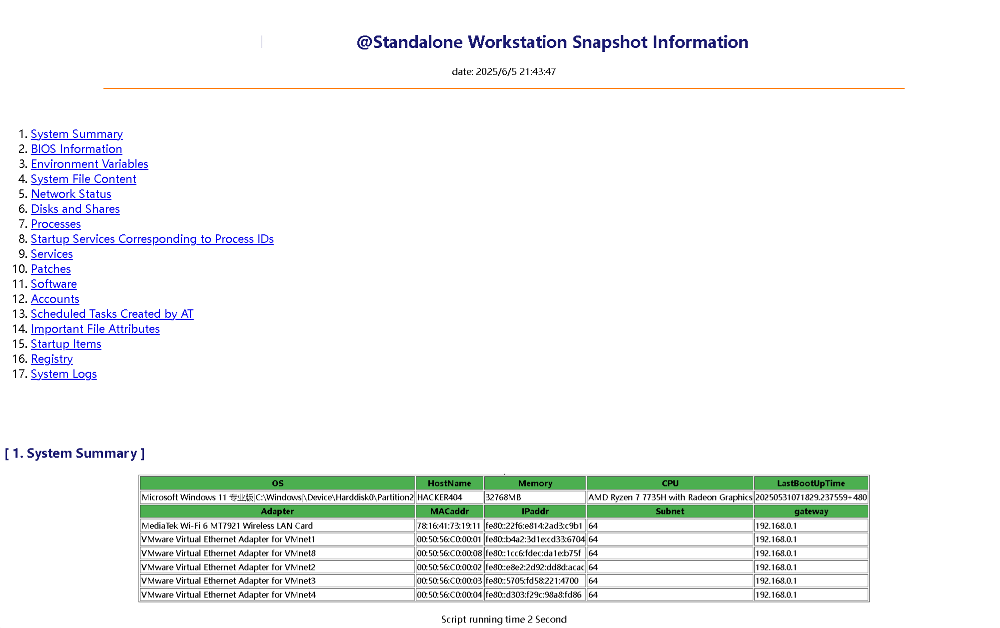

## Netspy 网段探测插件

需要的参数如下

```
-plg netspy //指定插件
-spymode rapid (默认值) / depth //rapid 急速探测，depth 深度探测
-cidr 10.10.10.10/16 //指定网段
```

命令行使用示例 `P1soda.exe -plg netspy -cidr 38.45.22.41/22,101.43.3.46/16`

```
P1soda (苏打水) 是一款迈向更高、更快、更强的全方位内网扫描工具, Powered by P001water
beta_version: 0.0.6

[INF] 38.45.22.41/22 is from 38.45.20.0 to 38.45.23.255
[INF] 101.43.3.46/16 is from 101.43.0.0 to 101.43.255.255
[INF] NetSpy mode: rapid
[INF] NetSpy num 520 ; spy example: [38.45.20.1 38.45.20.252]
[INF] 38.45.23.1      up --> 38.45.23.1/24
[INF] 38.45.22.1      up --> 38.45.22.1/24
[INF] 101.43.10.111   up --> 101.43.10.111/24
[INF] 101.43.2.135    up --> 101.43.2.135/24
[INF] 101.43.9.170    up --> 101.43.9.170/24
[INF] 101.43.4.75     up --> 101.43.4.75/24
[INF] 101.43.27.17    up --> 101.43.27.17/24
[INF] 101.43.34.196   up --> 101.43.34.196/24
[INF] 101.43.33.84    up --> 101.43.33.84/24
[INF] 101.43.16.173   up --> 101.43.16.173/24
[INF] 101.43.29.83    up --> 101.43.29.83/24
[INF] 101.43.6.8      up --> 101.43.6.8/24
[INF] 101.43.31.223   up --> 101.43.31.223/24
[INF] 101.43.1.218    up --> 101.43.1.218/24
[INF] 101.43.22.37    up --> 101.43.22.37/24
[INF] 101.43.21.16    up --> 101.43.21.16/24
[INF] 101.43.15.86    up --> 101.43.15.86/24
[INF] 101.43.28.116   up --> 101.43.28.116/24
[INF] 101.43.19.32    up --> 101.43.19.32/24
[INF] 101.43.35.189   up --> 101.43.35.189/24
[INF] 101.43.20.214   up --> 101.43.20.214/24
[INF] 101.43.37.136   up --> 101.43.37.136/24
[INF] 101.43.53.154   up --> 101.43.53.154/24
[INF] 101.43.55.241   up --> 101.43.55.241/24
[INF] 101.43.48.241   up --> 101.43.48.241/24
[INF] 101.43.40.30    up --> 101.43.40.30/24
[INF] 101.43.47.235   up --> 101.43.47.235/24
[INF] 101.43.39.166   up --> 101.43.39.166/24
[INF] 101.43.43.196   up --> 101.43.43.196/24
[INF] 101.43.66.89    up --> 101.43.66.89/24
[INF] 101.43.59.222   up --> 101.43.59.222/24
[INF] 101.43.65.149   up --> 101.43.65.149/24
[INF] 101.43.62.253   up --> 101.43.62.253/24
[INF] 101.43.67.47    up --> 101.43.67.47/24
[INF] 101.43.73.133   up --> 101.43.73.133/24
[INF] 101.43.69.110   up --> 101.43.69.110/24
[INF] 101.43.77.103   up --> 101.43.77.103/24
[INF] 101.43.74.65    up --> 101.43.74.65/24
[INF] 101.43.82.123   up --> 101.43.82.123/24
[INF] 101.43.70.46    up --> 101.43.70.46/24
[INF] 101.43.83.124   up --> 101.43.83.124/24
[INF] 101.43.71.191   up --> 101.43.71.191/24
[INF] 101.43.85.84    up --> 101.43.85.84/24
[INF] 101.43.95.188   up --> 101.43.95.188/24
[INF] 101.43.89.30    up --> 101.43.89.30/24
[INF] 101.43.96.6     up --> 101.43.96.6/24
[INF] 101.43.101.40   up --> 101.43.101.40/24
[INF] 101.43.90.35    up --> 101.43.90.35/24
[INF] 101.43.108.189  up --> 101.43.108.189/24
[INF] 101.43.86.224   up --> 101.43.86.224/24
[INF] 101.43.93.224   up --> 101.43.93.224/24
[INF] 101.43.97.43    up --> 101.43.97.43/24
[INF] 101.43.91.221   up --> 101.43.91.221/24
[INF] 101.43.110.186  up --> 101.43.110.186/24
[INF] 101.43.122.244  up --> 101.43.122.244/24
[INF] 101.43.120.28   up --> 101.43.120.28/24
[INF] 101.43.132.148  up --> 101.43.132.148/24
[INF] 101.43.117.3    up --> 101.43.117.3/24
[INF] 101.43.128.248  up --> 101.43.128.248/24
[INF] 101.43.127.30   up --> 101.43.127.30/24
[INF] 101.43.131.58   up --> 101.43.131.58/24
[INF] 101.43.151.202  up --> 101.43.151.202/24
[INF] 101.43.156.13   up --> 101.43.156.13/24
[INF] 101.43.142.12   up --> 101.43.142.12/24
[INF] 101.43.152.37   up --> 101.43.152.37/24
[INF] 101.43.149.130  up --> 101.43.149.130/24
[INF] 101.43.140.10   up --> 101.43.140.10/24
[INF] 101.43.165.181  up --> 101.43.165.181/24
[INF] 101.43.166.81   up --> 101.43.166.81/24
[INF] 101.43.162.211  up --> 101.43.162.211/24
[INF] 101.43.172.145  up --> 101.43.172.145/24
[INF] 101.43.161.106  up --> 101.43.161.106/24
[INF] 101.43.192.38   up --> 101.43.192.38/24
[INF] 101.43.200.90   up --> 101.43.200.90/24
[INF] 101.43.184.66   up --> 101.43.184.66/24
[INF] 101.43.199.41   up --> 101.43.199.41/24
[INF] 101.43.188.227  up --> 101.43.188.227/24
[INF] 101.43.206.226  up --> 101.43.206.226/24
[INF] 101.43.203.152  up --> 101.43.203.152/24
[INF] 101.43.210.168  up --> 101.43.210.168/24
[INF] 101.43.243.126  up --> 101.43.243.126/24
[INF] 101.43.240.20   up --> 101.43.240.20/24
[INF] 101.43.252.143  up --> 101.43.252.143/24
[INF] Net Segment Statistics:
101.43.0.0 [The Number of CSegment: 79]
  101.43.59.0/24 [1]
  101.43.95.0/24 [1]
  101.43.2.0/24 [1]
  101.43.33.0/24 [1]
  101.43.16.0/24 [1]
  101.43.4.0/24 [1]
  101.43.140.0/24 [1]
  101.43.240.0/24 [1]
  101.43.252.0/24 [1]
  101.43.31.0/24 [1]
  101.43.1.0/24 [1]
  101.43.77.0/24 [1]
  101.43.192.0/24 [1]
  101.43.34.0/24 [1]
  101.43.21.0/24 [1]
  101.43.28.0/24 [1]
  101.43.43.0/24 [1]
  101.43.70.0/24 [1]
  101.43.89.0/24 [1]
  101.43.108.0/24 [1]
  101.43.91.0/24 [1]
  101.43.6.0/24 [1]
  101.43.243.0/24 [1]
  101.43.156.0/24 [1]
  101.43.71.0/24 [1]
  101.43.85.0/24 [1]
  101.43.10.0/24 [1]
  101.43.128.0/24 [1]
  101.43.151.0/24 [1]
  101.43.117.0/24 [1]
  101.43.120.0/24 [1]
  101.43.199.0/24 [1]
  101.43.65.0/24 [1]
  101.43.35.0/24 [1]
  101.43.40.0/24 [1]
  101.43.66.0/24 [1]
  101.43.83.0/24 [1]
  101.43.27.0/24 [1]
  101.43.55.0/24 [1]
  101.43.110.0/24 [1]
  101.43.149.0/24 [1]
  101.43.172.0/24 [1]
  101.43.15.0/24 [1]
  101.43.19.0/24 [1]
  101.43.48.0/24 [1]
  101.43.73.0/24 [1]
  101.43.101.0/24 [1]
  101.43.97.0/24 [1]
  101.43.142.0/24 [1]
  101.43.22.0/24 [1]
  101.43.165.0/24 [1]
  101.43.210.0/24 [1]
  101.43.47.0/24 [1]
  101.43.74.0/24 [1]
  101.43.86.0/24 [1]
  101.43.161.0/24 [1]
  101.43.37.0/24 [1]
  101.43.96.0/24 [1]
  101.43.127.0/24 [1]
  101.43.166.0/24 [1]
  101.43.9.0/24 [1]
  101.43.67.0/24 [1]
  101.43.90.0/24 [1]
  101.43.93.0/24 [1]
  101.43.132.0/24 [1]
  101.43.152.0/24 [1]
  101.43.162.0/24 [1]
  101.43.200.0/24 [1]
  101.43.62.0/24 [1]
  101.43.203.0/24 [1]
  101.43.188.0/24 [1]
  101.43.20.0/24 [1]
  101.43.53.0/24 [1]
  101.43.69.0/24 [1]
  101.43.82.0/24 [1]
  101.43.122.0/24 [1]
  101.43.131.0/24 [1]
  101.43.184.0/24 [1]
  101.43.29.0/24 [1]
38.45.0.0 [The Number of CSegment: 2]
  38.45.23.0/24 [1]
  38.45.22.0/24 [1]

```


## 主机信息收集插件

目前只支持Windows基本信息收集

需要的参数如下

```
-plg infospy //指定插件
-collect basic // 基础信息收集模式
```

基础信息收集包括

```
系统基本信息、磁盘和共享信息、网络信息（网卡、arp缓存等等）、补丁、环境变量信息
```

命令行使用示例，`-plg infospy -collect basic`，

报告以`Html`形式输出在当前目录，命名格式为 `Hostnmae_Report.html`




##  主机敏感文件收集插件

目前只支持Windows

需要的参数如下

```
-plg filespy //指定插件
```

算了，下个版本再放吧