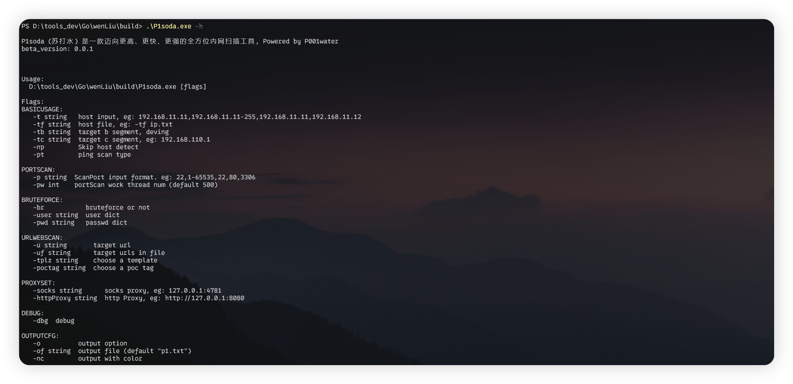
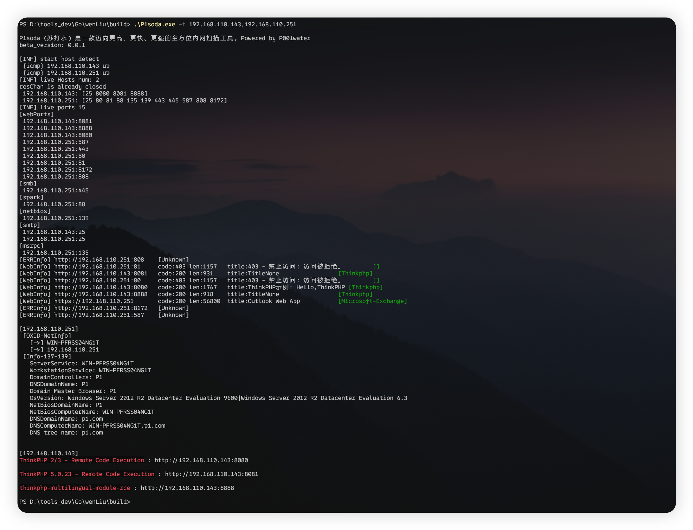
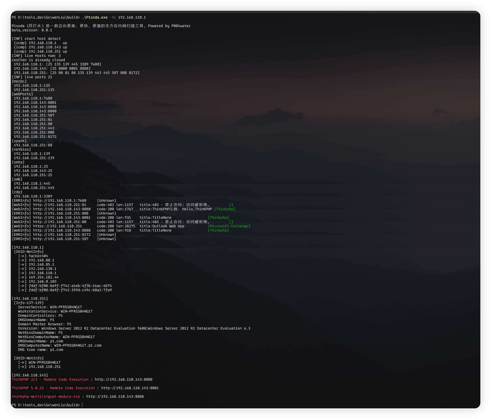
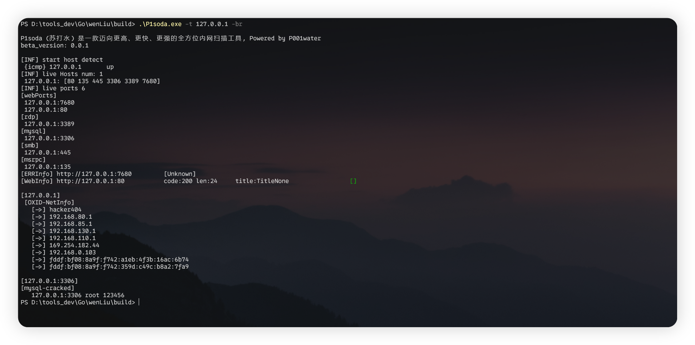
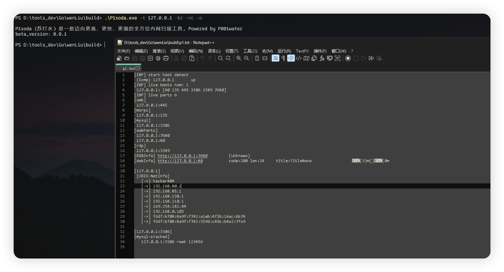
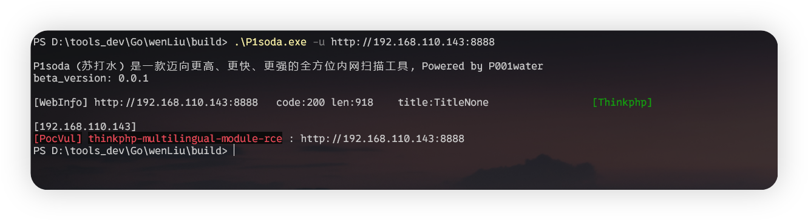
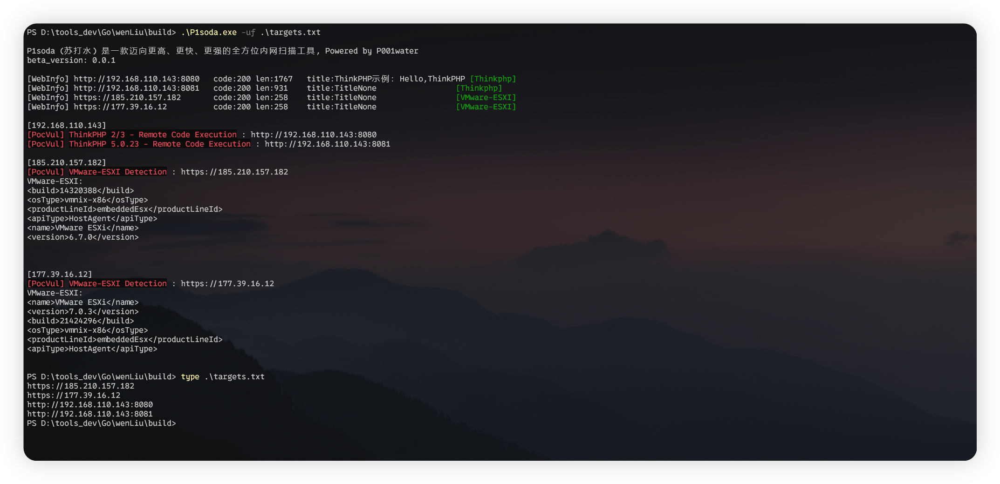
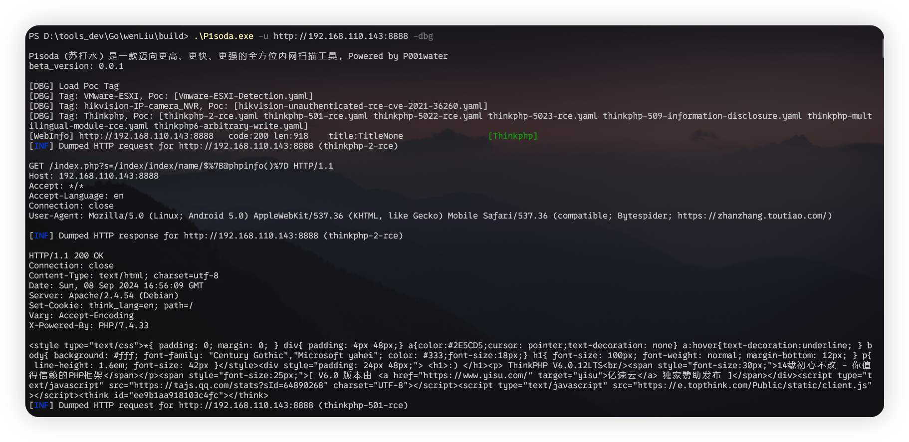

<h3 align="center">P1soda 一款更高、更快、更强的全方位内网扫描工具</h3>

---


P1soda （苏打水）是一款更高、更快、更强的全方位内网扫描工具，Powered by P001water


# 功能特色

* 主机存活探测

充分适应内网场景，ip输入，支持ICMP echo发包探测、ping命令探测

* 端口指纹识别

基于nmap-service-probes指纹实现的Mini nmap端口指纹识别引擎，出于工具体积和最小化请求原则只是从全部指纹中提取关键指纹

如下14条nmap Probe，支持指纹识别如下协议服务：

```
ftp
monetdb
mysql
ssh
postgresql
socks5
socks4
JDWP
mssql
memcached
redis
adb
```

* web 侧信息探测

http请求时User-Agent头随机化，基本web信息探测，http响应状态码，webTitle标题等

* web 重点资产指纹识别

从P1finger中精简的内网常见系统的指纹

* OXID Resolver DCOM接口未授权网卡探测

socket Raw连接发包解决，避免调包，最小化工具体积

* NetBIOS 137 139 主机信息探测

137 NBNS、139 NTLMSSP协议中的主机信息提取，137 NBNS协议域控识别

* 常见服务爆破功能，例如ftp、mysql等等

根据返回报文更加智能化的服务爆破，减少无用的爆破，目前支持爆破模块

```
Ftp
mysql
ssh
```

* web 漏洞检测

从头实现的Mini Nuclei引擎，体积小于 2 M，支持nuclei的POC

* socks5、http代理使用

支持socks5、http代理使用

​	

# 基本使用

工具参数如下图，默认情况下不开启服务爆破功能



* 入门使用

单个、多个目标探测

```
P1soda.exe -t 192.168.110.235 	// 单个目标
P1soda.exe -t 192.168.110.2-235 // 多个目标
P1soda.exe -t 192.168.110.143,192.168.110.251 // 多个目标
```



* C 段探测

-tc 指定ip即可，自动探测ip所在C段

```
.\P1soda.exe -tc 192.168.110.229 -br // -br 开启爆破功能

.\P1soda.exe -tc 192.168.110.229,192.168.1.1 // 探测192.168.110.229,192.168.1.1两个C段
```



* 指定用户名密码爆破

```
.\P1soda.exe -t 127.0.0.1 -br -user root,admin -pwd 123456 // -br 开启爆破模式，默认情况不开启
```



* 输出保存文件

```
.\P1soda.exe -t 127.0.0.1 -br -nc -o // -br开启爆破模式, -o输出重定向到p1.txt, -nc取消颜色输出
```



* 针对url的检测

单个url目标

```
.\P1soda.exe -u http://192.168.110.251
```



多个目标

```
.\P1soda.exe -uf .\targets.txt
```



* Debug 测试信息

```
.\P1soda.exe -u http://192.168.110.143:8888 -dbg
```

debug显示一些poc信息，http请求信息



* 网段探测

更多功能，正在设计中，敬请期待......


# 碎碎念

* 关于漏洞检测功能

漏洞检测功能用的是nuclei的poc。nuclei发展到现在，功能太多导致即使是直接调用SDK打包后的体积也不少于70M。

于是从头实现了nuclei的检测引擎，但是修改了nuclei Poc的Tag字段，整合poc的tag，并根据指纹识别的结果扫描对应标签内Poc


* 默认扫描端口的选择

默认扫描端口由三部分组成

1. 著名服务的固定端口，如ssh 22，rdp 3389等
2. fofa、hunter等统计的服务端口top10端口，如ftp端口top10，其他同理
3. web服务的端口，统计fofa、hunter常见OA、cms系统top 10分布端口汇总

默认扫描端口如下

```
var WebPort = []int{21, 22, 25, 80, 81, 82, 83, 84, 85, 86, 87, 88, 89, 90, 91, 92, 98, 99, 135, 139, 143, 443, 445, 587, 800, 801, 808, 880, 888, 889, 1000, 1010, 1080, 1081, 1082, 1099, 1118, 1433, 1443, 1521, 1888, 2008, 2020, 2022, 2100, 2375, 2379, 3000, 3306, 3389, 3505, 5432, 5555, 6080, 6379, 6648, 6868, 7000, 7001, 7002, 7003, 7004, 7005, 7007, 7008, 7070, 7071, 7074, 7078, 7080, 7088, 7200, 7680, 7687, 7688, 7777, 7890, 8000, 8001, 8002, 8003, 8004, 8006, 8008, 8009, 8010, 8011, 8012, 8016, 8018, 8020, 8028, 8030, 8038, 8042, 8044, 8046, 8048, 8053, 8060, 8069, 8070, 8080, 8081, 8082, 8083, 8084, 8085, 8086, 8087, 8088, 8089, 8090, 8091, 8092, 8093, 8094, 8095, 8096, 8097, 8098, 8099, 8100, 8101, 8108, 8118, 8161, 8172, 8180, 8181, 8200, 8222, 8244, 8258, 8280, 8288, 8300, 8360, 8443, 8448, 8484, 8500, 8800, 8834, 8838, 8848, 8858, 8868, 8879, 8880, 8881, 8888, 8889, 8899, 8917, 8983, 8989, 9000, 9001, 9002, 9008, 9010, 9043, 9060, 9080, 9081, 9082, 9083, 9084, 9085, 9086, 9087, 9088, 9089, 9090, 9091, 9092, 9093, 9094, 9095, 9096, 9097, 9098, 9099, 9100, 9190, 9200, 9443, 9448, 9458, 9800, 9981, 9986, 9988, 9998, 9999, 10000, 10001, 10002, 10004, 10008, 10010, 10250, 10443, 11211, 12018, 12443, 14000, 16080, 18000, 19001, 20000, 20720, 20880, 21000, 30000, 50000, 50001}
```

默认端口会持续更新


* ftp、mysql等爆破模块的设计

爆破模块更具智能化，根据端口响应判断是否继续爆破，减少爆破模块的动静。


* 和现有的内网扫描工具的区别

P1soda工具的定位是内网扫描工具，同类型最出名的就是fscan了，笔者也做过fscan的二开，但是二开总会被工具原有的架构限制。于是从头设计了这款P1soda，寻求一个自己的解决方案

个人感觉goland对于安全工具的开发已经进入到了一个什么类型的工具都有，都可以找到借鉴。
但是每个开发者又都有自己的使用习惯和思考。P1soda则是我结合实战需求在工具开发上的尝试。


* 后续功能开发

原本计划的功能还包括网段探测，redis未授权检测等等，只是当前计划有变，于是暂缓了

