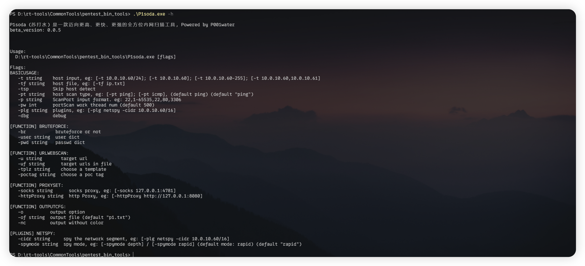
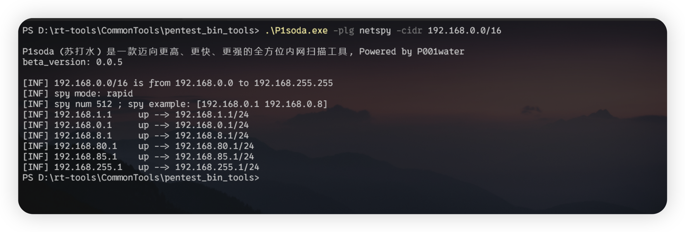

<h3 align="center">P1soda 一款更高、更快、更强的全方位内网扫描工具</h3>

---


P1soda （苏打水）是一款常规内网渗透场景下的全方位漏洞扫描工具，Powered by P001water


## Version

当前最新版本 `v0.0.6` （2025/6/08更新）[更新日志参见](https://github.com/P001water/P1soda/blob/master/更新日志.md)


# 功能特色

* 主机存活探测

充分适应内网场景，支持多种格式输入

例如`[-t 10.0.10.60/24]; [-t 10.0.10.60]; [-t 10.0.10.60-255]; [-t 10.0.10.60,10.0.10.61]`

支持ping命令探测（ version > 0.0.5 默认选择ping命令探测），ICMP echo发包探测

* 内网网段探测

快速探测内网可达网段，参考插件模式调用

例子：探测B段，`[-plg netspy -cidr 192.168.8.10/16]`

* 端口指纹识别

基于nmap-service-probes指纹实现的Mini nmap端口指纹识别引擎，出于工具体积和最小化请求原则只是从全部指纹中提取关键指纹

如下14条nmap Probe，支持指纹识别如下协议服务：

```
ftp、monetdb、mysql、ssh、postgresql、
socks5、socks4、JDWP、mssql、memcached
redis、adb、VNC
```

* web 侧信息探测

http请求时User-Agent头随机化，基本web信息探测，http响应状态码，webTitle标题等

* web 重点资产指纹识别

从P1finger中精简的内网常见系统的指纹

* web 漏洞检测

从头实现的Mini Nuclei引擎，体积小于 2 M，支持nuclei的POC

* OXID Resolver DCOM接口未授权网卡探测

socket Raw连接发包解决，避免调包，最小化工具体积

* NetBIOS 137 139 主机信息探测

137 NBNS、139 NTLMSSP协议中的主机信息提取，137 NBNS协议域控识别

* 常见服务爆破功能，例如ssh、ftp、mysql、vnc等等

根据返回报文更加智能化的服务爆破，减少无用的爆破，目前支持爆破模块

```
Ftp
mysql
ssh
vnc
```

* socks5、http代理使用

支持socks5、http代理使用

* MS-17010检测，redis未授权，vnc未授权检测等等


# 基本使用

工具参数如下图，默认情况下不开启服务爆破功能



* 入门使用

单个、多个目标探测，支持CIDR网段输入

```
P1soda.exe -t 192.168.110.235 	// 单个目标
P1soda.exe -t 192.168.110.2-235 // 多个目标
P1soda.exe -t 192.168.110.143,192.168.110.251 // 多个目标
P1soda.exe -t 192.168.110.235/24 // 扫描110 C段
```


* 内网网段探测

```
.\P1soda.exe -plg netspy -cidr 192.168.0.0/16
```



* 指定用户名密码爆破

```
.\P1soda.exe -t 127.0.0.1 -br -user root,admin -pwd 123456 // -br 开启爆破模式，默认情况不开启
```


* 输出保存文件

```
.\P1soda.exe -t 127.0.0.1 -br -nc -o // -br开启爆破模式, -o输出重定向到p1.txt, -nc取消颜色输出
```


* 针对url的检测

单个url目标

```
.\P1soda.exe -u http://192.168.110.251
```


多个目标

```
.\P1soda.exe -uf .\targets.txt
```


* Debug 测试信息

```
.\P1soda.exe -u http://192.168.110.143:8888 -dbg
```

debug显示一些poc信息，http请求信息


